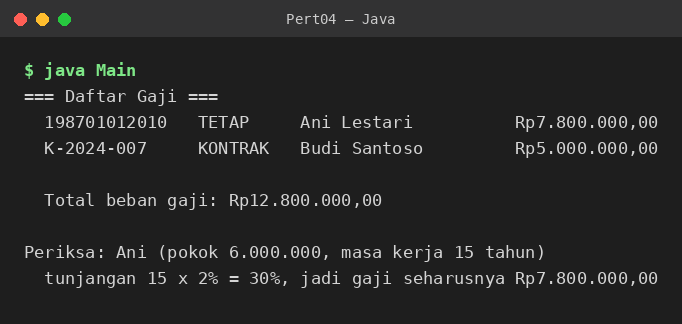
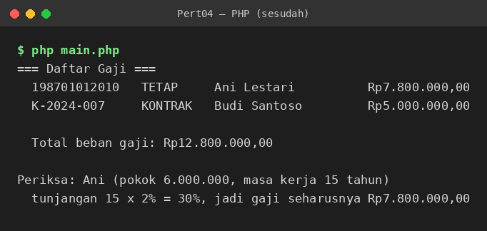

# Laporan Praktikum 04: Pewarisan (Inheritance)

| | |
|---|---|
| **Nama** | Muzaki Arifin |
| **NPM** | 4525210051 |
| **Kelas** | PBO A 2025/2026 |
| **Dosen Pengampu** | Adi Wahyu Pribadi, S.Si., M.Kom |

---

## 1. Ringkasan Soal

Sistem penggajian memiliki beberapa jenis pegawai. Bagian yang sama di semua jenis (NIP, nama, gaji pokok) ditaruh di kelas induk `Pegawai`, sedangkan perbedaan cara menghitung gaji ditangani oleh kelas turunan.

- **Pegawai tetap:** gaji = gaji pokok + tunjangan masa kerja (2% gaji pokok per tahun, maksimum 40%).
- **Pegawai kontrak:** gaji = gaji pokok, tanpa tunjangan masa kerja.

---

## 2. Implementasi Java

**Kode awal:** [Pegawai.java (sebelum)](https://github.com/MuzakiArifin23/pbo-a-MuzakiArifin-25051/blob/main/codingan%20sebelum%20dibenerin/pertemuan04/Pegawai.java) · [PegawaiTetap.java (sebelum)](https://github.com/MuzakiArifin23/pbo-a-MuzakiArifin-25051/blob/main/codingan%20sebelum%20dibenerin/pertemuan04/PegawaiTetap.java)  
**Kode akhir:** [Pegawai.java (sesudah)](https://github.com/MuzakiArifin23/pbo-a-MuzakiArifin-25051/blob/main/pbo-a-MuzakiArifin-25051/Pert04/src/Pegawai.java) · [PegawaiTetap.java (sesudah)](https://github.com/MuzakiArifin23/pbo-a-MuzakiArifin-25051/blob/main/pbo-a-MuzakiArifin-25051/Pert04/src/PegawaiTetap.java) · [PegawaiKontrak.java (sesudah)](https://github.com/MuzakiArifin23/pbo-a-MuzakiArifin-25051/blob/main/pbo-a-MuzakiArifin-25051/Pert04/src/PegawaiKontrak.java) · [Main.java (sesudah)](https://github.com/MuzakiArifin23/pbo-a-MuzakiArifin-25051/blob/main/pbo-a-MuzakiArifin-25051/Pert04/src/Main.java)

Kondisi awal: gaji semua pegawai tampil Rp0,00 dan total beban gaji Rp0,00, karena `hitungGaji()` belum diisi.

Yang saya kerjakan:

- `Pegawai` adalah kelas `abstract` dengan atribut `protected final`, sehingga turunan boleh membacanya tetapi dunia luar tidak.
- Constructor `Pegawai` menolak gaji pokok negatif dengan `IllegalArgumentException`, dan `hitungGaji()` mengembalikan gaji pokok apa adanya sebagai perilaku dasar.
- `jenis()` dibuat `abstract` supaya setiap turunan wajib menyebutkan jenisnya sendiri.
- `PegawaiTetap` memanggil `super(...)` di baris pertama constructor, lalu meng-override `hitungGaji()` dengan `super.hitungGaji()` ditambah tunjangan `Math.min(masaKerja * 2%, 40%)`. Rumus gaji pokok tidak disalin ulang.
- `PegawaiKontrak` tidak meng-override `hitungGaji()` karena memang tidak ada tambahan; perilaku dasar dari induk sudah tepat.
- `Main` memegang array bertipe `Pegawai[]`, sehingga perulangan cetak dan penjumlahan total tidak perlu tahu jenis pegawainya.

---

## 3. Implementasi PHP

**Kode awal:** [Pegawai.php (sebelum)](https://github.com/MuzakiArifin23/pbo-a-MuzakiArifin-25051/blob/main/codingan%20sebelum%20dibenerin/pertemuan04/Pegawai.php)  
**Kode akhir:** [Pegawai.php (sesudah)](https://github.com/MuzakiArifin23/pbo-a-MuzakiArifin-25051/blob/main/pbo-a-MuzakiArifin-25051/Pert04/src/php/Pegawai.php) · [main.php (sesudah)](https://github.com/MuzakiArifin23/pbo-a-MuzakiArifin-25051/blob/main/pbo-a-MuzakiArifin-25051/Pert04/src/php/main.php)

Kondisi awal: sama seperti Java, semua gaji tampil Rp0,00.

Seluruh hierarki ditaruh dalam satu berkas, dengan logika yang sama seperti Java:

- Properti `protected readonly` lewat constructor property promotion.
- Constructor menolak gaji pokok negatif dengan `InvalidArgumentException`.
- `PegawaiTetap::hitungGaji()` memakai `parent::hitungGaji()` ditambah tunjangan `min(masaKerja * 2%, 40%)`.
- `PegawaiKontrak` hanya menambahkan `jenis()` dan atribut `bulanKontrak`.
- Total gaji di `main.php` dihitung dengan `array_sum(array_map(...))` atas daftar bertipe `Pegawai`.

---

## 4. Bukti Eksekusi

### Java

Sebelum perbaikan:

Sesudah perbaikan (`java Main`):

### PHP

Sebelum perbaikan:

Sesudah perbaikan (`php main.php`):

<!-- TODO: screenshot ini masih menampilkan Rp0,00 (diambil sebelum perbaikan tersimpan). Jalankan ulang `php main.php`, lalu ganti images/php-sesudah.png. Hasil yang benar: Ani Rp7.800.000,00 / Budi Rp5.000.000,00 / total Rp12.800.000,00. -->

---

## 5. Kesimpulan

Pewarisan memungkinkan bagian yang sama ditulis sekali di kelas induk, lalu dikembangkan oleh turunan lewat `super` / `parent`. Gaji Ani (pokok Rp6.000.000, masa kerja 15 tahun, tunjangan 30%) menjadi Rp7.800.000, sedangkan gaji Budi sebagai pegawai kontrak tetap Rp5.000.000, dengan total beban gaji Rp12.800.000. Batas tunjangan 40% baru tercapai pada masa kerja 20 tahun.
